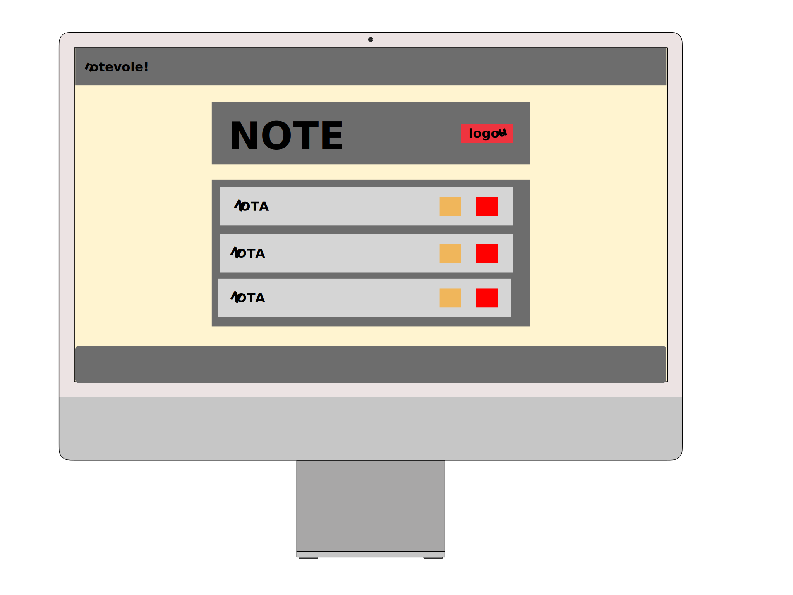
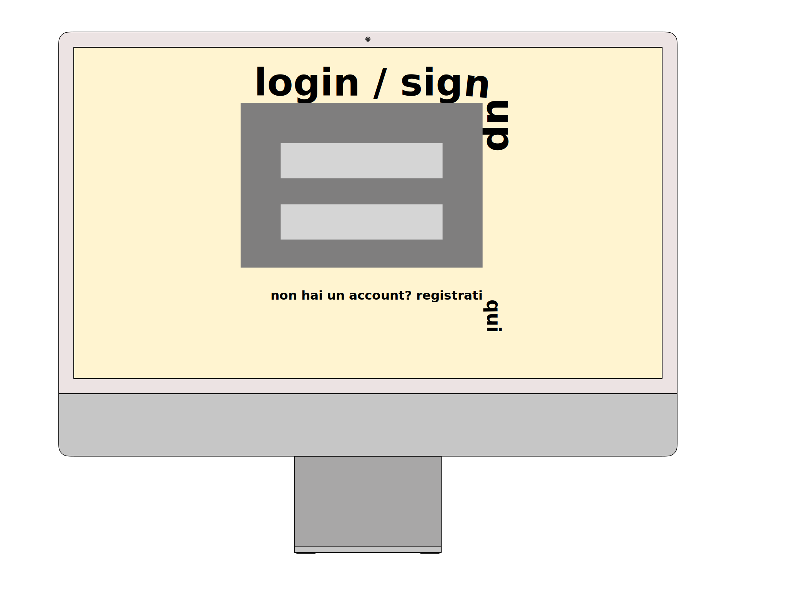
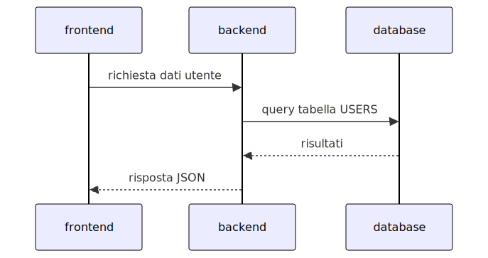

---
title: "relazione - ingegneria dei sistemi web"
author: [Jacopo Maria Spitaleri]
date: "AA 2024/2025"
...

# Relazione del progetto
Il progetto punta a un implementazione di un'applicazione web full-stack improntata più alla qualità e sicurezza del backend, mantenendo un frontend minimale e funzionale
rispetto al precedente progetto di Fondamenti di Sistemi Web, improntato invece verso la parte visiva. Tuttavia, è stata posta attenzione a mantenere il sito accessibile e fruibile
da dispositivi diversi tramite l'utilizzo corretto di tag e test della responsività.

## Backend
Il backend è stato sviluppato utilizzando **Node.js** con **Express** come framework principale.
Il database relazionale è gestito con **MySQL**, con la gestione delle query SQL implementata direttamente tramite **Axios** per mantenere un maggiore livello di flessibilità
e semplicità.

### Architettura
L'architettura del backend segue un approccio modulare:



### Feature principali
- **Autenticazione**: implementata con sessioni e middleware per gestione della sicurezza degli endpoint.
- **CRUD**: CRUD su entità chiave come utenti e argomenti.
- **API RESTful**: tutti gli endpoint seguono le politiche REST.

#### Configurazione del Database
Per inizializzare il database è sufficiente utilizzare lo schema definito in  `server/database/schema.sql`. Se si utilizza l'interfaccia da linea di comando
di `mysql`, può essere inizializzato con:

```bash
mysql -u root -p < server/database/schema.sql
```

Le credenziali sono configurabili tramite un file `.env`. Per istruzioni riguardo al setup del sito, visitare il [README](/README.md)

## Frontend e Mockup
Il frontend è stato sviluppato con **HTML**, **CSS** e **JavaScript**, utilizzando **Bootstrap** per il layout responsivo.
L'obiettivo principale è stato creare una UI intuitiva e compatibile con dispositivi mobili e desktop, cercando di limitare al minimo l'utilizzo di css custom per garantire
un interfaccia coerente basata sulle specifiche di boostrap.




### Elementi Specifici
- **Navbar**: si adatta dinamicamente alle dimensioni dello schermo. Include un tasto riportante il logo che reindirizza alla pagina principale.
- **Pulsanti**: sfruttano il feedback visivo al clic nativo di bootstrap per migliorare l'interattività da mobile.
- **Blocchi di testo**: posizionati in layout flessibile che varia tra verticale e orizzontale.

## Diagramma dei Dati
Il flusso dei dati tra il frontend e il backend è illustrato di seguito:



## Sviluppo e debug
La gestione degli errori nel backend avviene tramite middleware dedicati. Gli errori vengono loggati direttamente in console per analisi durante lo sviluppo.
L'utente viene notificato dell'esito delle sue azioni tramite notifiche toast.
